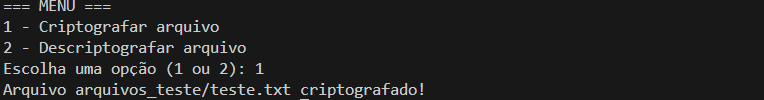
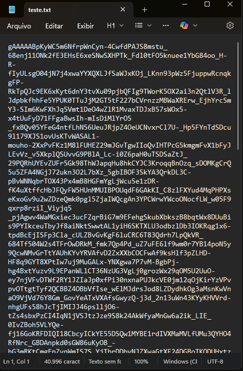
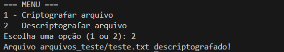
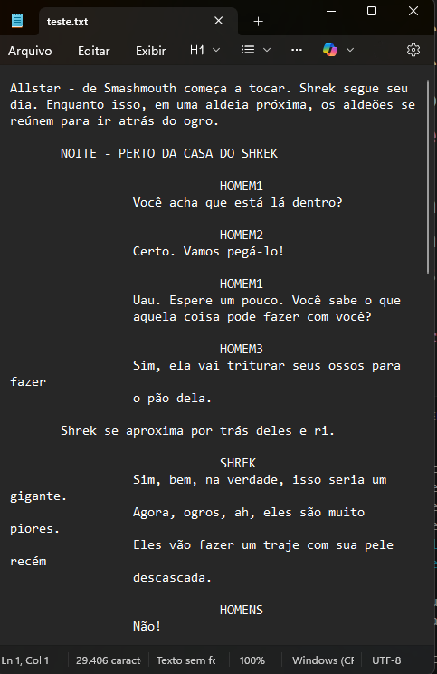

# Ransomware Educativo em Python  
Projeto – Bootcamp Santander Cibersegurança 2025 (DIO)

Este projeto foi desenvolvido como DESAFIO PRÁTICO do Bootcamp Santander – Cibersegurança 2025 (DIO), com foco em entender, de forma ética e controlada:

- como um ransomware baseado em criptografia simétrica pode funcionar
- como organizar o código em módulos reutilizáveis
- como tratar erros de forma útil para análise e defesa

O objetivo é exclusivamente EDUCATIVO, alinhado à proposta do bootcamp de aprender como pensam atacantes para melhor proteger sistemas.

---

## Aviso Importante

Este código é destinado apenas a:

- estudo em ambiente controlado
- uso em arquivos de teste

NÃO utilize em:

- máquinas de terceiros  
- ambientes de produção  
- arquivos reais ou sensíveis

O uso malicioso deste código é antiético, ilegal e totalmente contrário aos princípios do bootcamp e da área de cibersegurança.

---

## Contexto do Bootcamp

Projeto desenvolvido no contexto do:

- Bootcamp: Santander – Cibersegurança 2025 (DIO)
- Trilha: segurança ofensiva e fundamentos de Python para cibersegurança
- Tema: criação de um protótipo de ransomware EDUCATIVO para entender:
  - criptografia de arquivos
  - fluxo básico ataque/defesa
  - importância da chave de criptografia e do tratamento de erros

---

## Estrutura do Projeto

    projeto-malware-educativo/
    ├── crypto_utils.py       # Funções de criptografia e descriptografia
    ├── encrypt_main.py       # Script para CRIPTOGRAFAR um arquivo
    ├── decrypt_main.py       # Script para DESCRIPTOGRAFAR um arquivo
    ├── ransomware_main.py    # Script com menu (1 = criptografar, 2 = descriptografar)
    ├── filekey.key           # Chave simétrica gerada 
    ├── arquivos_teste/
    │   └── teste.txt         # Arquivo de teste
    └── prints/               # Capturas de tela de execução 

---

## Como Funciona

O projeto usa criptografia simétrica com a biblioteca `cryptography` (Fernet):

- A chave é gerada e salva em `filekey.key`.
- O módulo `crypto_utils.py` concentra a lógica principal:
  - `carregar_chave()`
  - `criptografar_arquivo(caminho_arquivo)`
  - `descriptografar_arquivo(caminho_arquivo)`  
    - com tratamento do erro `InvalidToken` quando:
      - a chave não corresponde
      - o arquivo não é um token Fernet válido
      - o conteúdo foi corrompido

Isso permite simular, de forma controlada, o comportamento de:

- “sequestro” de um arquivo (criptografia)
- recuperação do arquivo com a chave correta (descriptografia)

---

## Pré-requisitos

- Python 3 instalado
- Biblioteca `cryptography` instalada:

pip install cryptography

text

---

## Uso

### 1. Preparar o arquivo de teste

Crie o arquivo:

- `arquivos_teste/teste.txt`

Coloque algum texto simples, por exemplo:

> Este é um teste de criptografia para o Bootcamp Santander Cibersegurança 2025 (DIO).

---

### 2. Criptografar arquivo (modo simples)

Rode:

python encrypt_main.py

text

- O arquivo `arquivos_teste/teste.txt` será criptografado.
- Ao abrir, o conteúdo estará ilegível (token Fernet em base64).

---

### 3. Descriptografar arquivo (modo simples)

Rode:

python decrypt_main.py

text

- Se o arquivo foi criptografado com a MESMA chave (`filekey.key`), o conteúdo volta a ser legível.
- Se a chave não corresponder ou o arquivo estiver corrompido, a saída será algo como:

Erro: o arquivo não está criptografado com essa chave ou foi corrompido.

text

---

### 4. Uso com menu (criptografar ou descriptografar)

Rode:

python ransomware_main.py

text

Exemplo de saída:

=== MENU ===
1 - Criptografar arquivo
2 - Descriptografar arquivo
Escolha uma opção (1 ou 2):

text

- Digite `1` para criptografar `arquivos_teste/teste.txt`.
- Digite `2` para descriptografar o mesmo arquivo.

---

## Exemplos de Execução

### 1. Criptografando arquivo

### 2. Arquivo após criptografia

### 3. Descriptografando arquivo

### 4. Arquivo restaurado

Esses prints ajudam a visualizar o funcionamento do protótipo e são úteis para apresentação do desafio no bootcamp.

---

## Tratamento de Erros

Na função `descriptografar_arquivo`, é tratado o erro `InvalidToken`, que indica que:

- o arquivo não foi criptografado com essa chave
- o conteúdo foi alterado/corrompido
- o arquivo não é um token Fernet válido

Em vez de derrubar o programa com um traceback, é exibida uma mensagem clara.  
Em um contexto de cibersegurança, isso pode ajudar em:

- testes de recuperação com diferentes chaves
- identificação de arquivos que ainda podem ser recuperados
- documentação e análise de incidentes (resposta a incidentes/forense)

---

## Objetivo Educacional e Ético

Este projeto reforça um ponto central da trilha de Cibersegurança:

> entender como ameaças funcionam é essencial para saber como detectá-las, bloqueá-las e responder a incidentes.

Por isso, este código:

- DEVE ser usado apenas para:
  - estudo
  - laboratórios em ambiente controlado
  - demonstrações acadêmicas

- NÃO DEVE ser usado para:
  - prejudicar terceiros
  - esconder atividades maliciosas
  - qualquer ação fora dos limites éticos e legais

Segurança é responsabilidade tanto técnica quanto ética.

---

## Autor

- Nome: Rafael Santos  
- Bootcamp: Santander – Cibersegurança 2025 (DIO)  
- GitHub: https://github.com/rafaelmessias13
